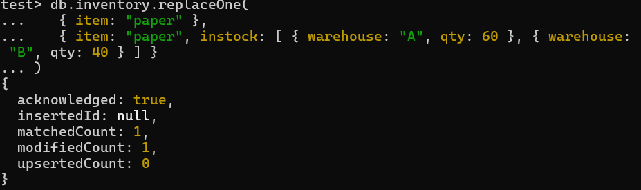

# DAT250 Expass 5
- Olav Høysæther Opheim

## Short Report
In this i got familiar with MongoDB by following the tutorial, reading, setting up a DB and using basic CRUD operations.

## Technical problems
- I had no techinal problems during this expass

## Screenshots

### Verifying mongodb packages

## Experiment 1: MongDB CRUD operations
In this experiment i followed the tutorial linked in the assignment, and below you can find some screenshots from me following the tutorial using the mongo shell

### Insert
Using InsertOne()

Using Find()

Using insertMany()

### Query
I insert some data into a collection so that i can do some queries.

A simple find query-

Use find and specify "AND" conditions

Here is a more complex query i used in the tutorial

which corresponds to the following sql statement: SELECT * FROM inventory WHERE status = "A" AND ( qty < 30 OR item LIKE "p%")

### Update
- First i insert the data we are using for this tutorial

- Using the updateOne function

- Using the replaceOne function

### Remove
- Data i inserted for this tutorial 

- Using the delte one function

- Using the delete many function

### Bulk write
- Bulk writing is a way to preform a bulk (multiple) operations in one execution. For this tutorial i fist insert some data as explained in the tutorial, before executing a bulk write.

## Expermient 2: Aggregation
- I start by insterting the data.

- We now define the functions and can query the new collection and get the results.
- The mapReduce function was deprecated so i had to use the aggregate function.

## Reasons why Map-reduced operation is useful 
- Map reduced is useful for processing and analyzing large data sets. It is very useful when dealing with operations that require aggregation.

## Pending issues
- There are no pending issues