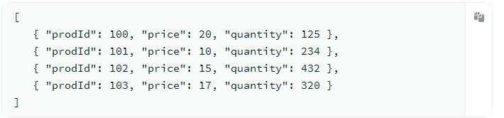
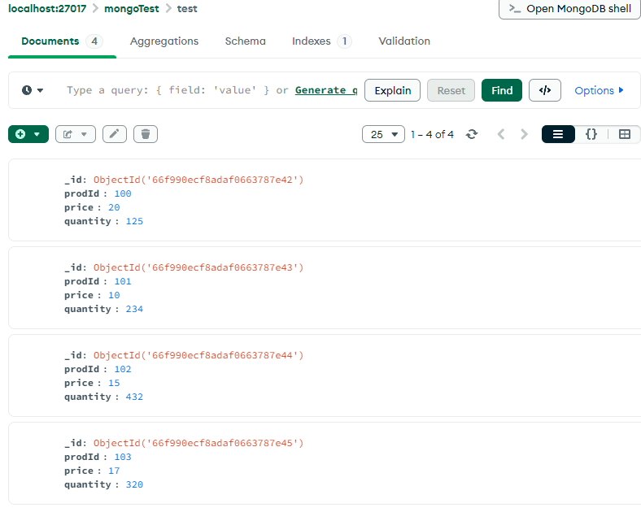

# DAT250 Expass 5
- Olav Høysæther Opheim

## Short Report
In this i got familiar with MongoDB by following the tutorial, reading, setting up a DB and using basic CRUD operations.

## Technical problems
- I had no techinal problems during this expass

## Screenshots

### Verifying mongodb packages

## Experiment 1: MongDB CRUD operations
- Here are some screenshots from some of the crud operations i used when following the tutorials, i tested them on a test database i created.

### Insert

### Query

- Querying to find a specific object given objectid

### Update

- Added a "prodID: 0" to all and also updated the quantity of the first object to be 15 instead of prevoisly 125.

### Remove

- Deleted by using the interface and clciking delte on the given object

### Bulk write
For the following i used the test database that i have been using for the above crud operations, but added a pizzas collection as shown in the tutorial. And then ran the following commands to bulk write.

## Expermient 2: Aggregation

### Example working

#### Inserting documents

#### Defining map fucntion, reduce function and preform map reduce

- The mapReduce function was deprecated so i had to use the aggregate function.

## Reasons why Map-reduced operation is useful 
- Map reduced is useful for processing and analyzing large data sets. It is very useful when dealing with operations that require aggregation.

## Pending issues
- There are no pending issues