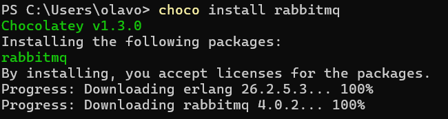
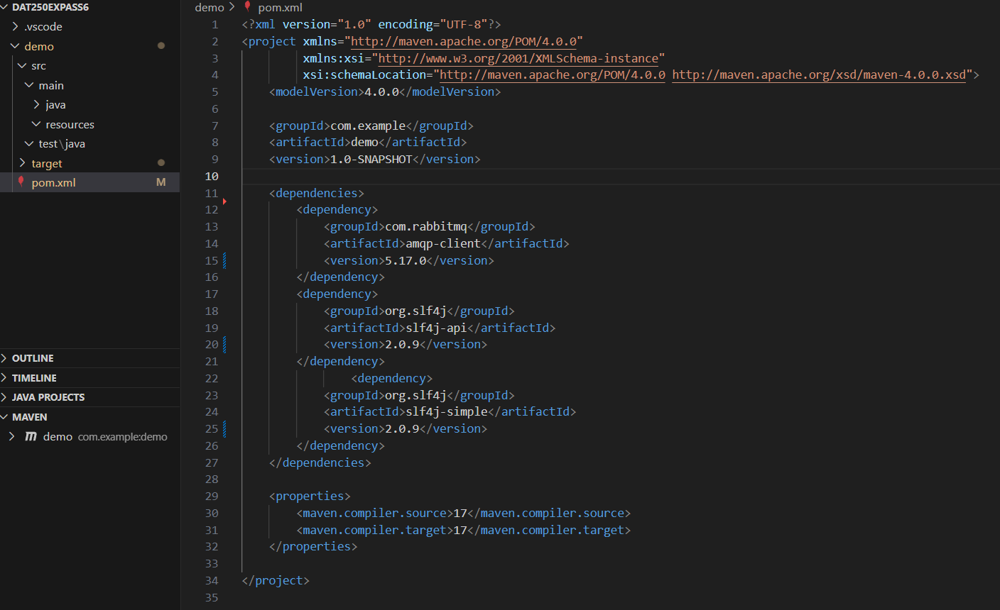

# DAT250 Expass 6
- Olav Høysæther Opheim

## Experiment 1: Installation
I installed rabbit by using the command, as explained in the installation guide.

## Experiment 2: Hello World
I started by settingup a simple maven project and added the dependecy to the pom xml file.

After the prokect was setup i followed the tutorial, see link for code.

## Experiment 3: Work Queues
See link for code.

## Experiment 4: Topics
See link for code.

## Link to code
- Link: https://github.com/ollav12/DAT250Expass6

## Pending issuses or technical problems
- I have solved all the experiments
Issues/techical problems i had, that i resolved:
- I struggled a bit with setting up the rabbitmq servers. I got invalid challenge reply, so i had to change the .erlang.cookie file so that the server and client node had matching cookie.
- I struggled with using the commands for compiling and executing the script, but i manged to figure it out after some trial and error.