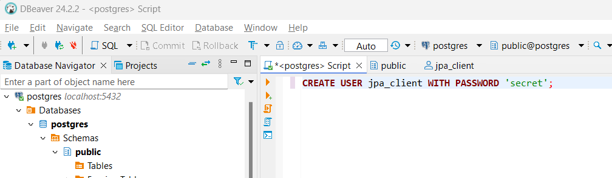

# DAT250 Expass 7
- Olav Høysæther Opheim

## Part 1: Switching from H2 to PostgreSQL using docker image 
- Link to expass4 code: https://github.com/ollav12/dat250-jpa-tutorial

### Setup
- I am working on a different computer than expass 1 so i have to install docker using the tutorial from expass 1. And under you can see an image where i can verify that docker is installed on the system with no errors.

### Postgre docker image
- I run the "docker pull postgres" command in terminal to download a postgre image to my machine.

### Docker ...
- Creating a docker instance
 

- Running "docker ps" and "docker logs jpa"

### Connecting to PostgreSQL using DBeaver
- I connect to the sql clinet using DBeaver and created a user

- I have now updated the build.gradle.kts file

- Here i updated the presistence.xml file

### Updating database
- Using DBeaver i manually execute the sql query script "scheme.up.sql" that is created when gradle test is ran and the database is up to date

- I updated the privelages to the "jpa_client" user so that the test would pass (see issues).

## Part 2: Creating a docker image
- The docker file is located in this repository but here is also a link: https://github.com/ollav12/DAT250/blob/main/Dockerfile

### Creating the Dockerfile
- I created a dockerfile

### Running docker build command
- In the image below you can see the docer command i used to create the docker image

### Checking that the image was created and testing it
- I ran "docker images" to list all images created, we can infact see that the image is created.

- Running the image also works as you can see in the image below
 

- Another image showing running docker containers

## Issues and techical difficulites
- Part 1:
    - The "jpa_client" user did not have the correct privelages in the database to execute the sql scripts so when connecting to the databse with the user, all the tests failed. I updated to give access/permission in all tables and the tests now pass!
    - I tinkered around with the .xml file to see if there were some settings there that was causing the databse to not update/create the tables. Once i reread the tutorial i saw that i had to manually execute the schema.up.sql in dbeaver for the tables to be created.
- Part 2:
    - I struggled alot with being able to create the docker image, so i used alot of time to check if the issues was in the gradle files. I concluded that the issue was in the dockerfile since: gradle bootRun, gradle test, gradle clean and gradle bootJar all worked localy. I then made some changes to the dockerfile and creating an docker image was succesful!